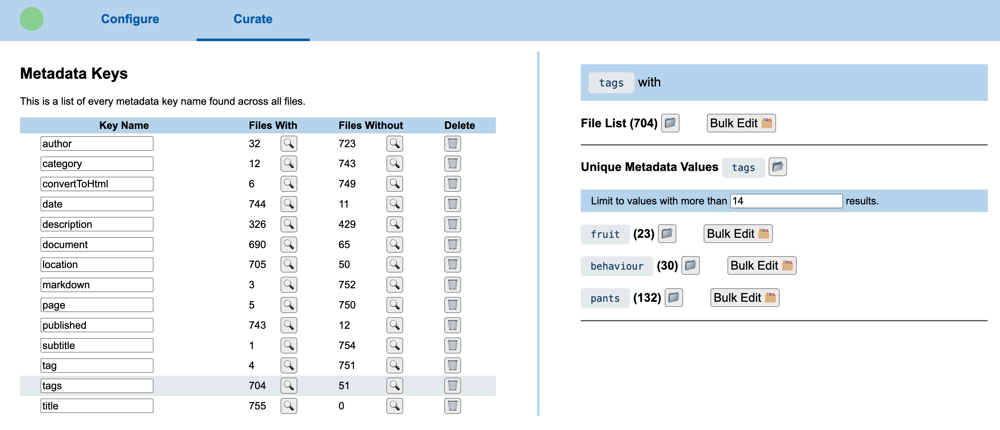
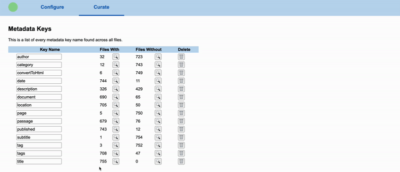
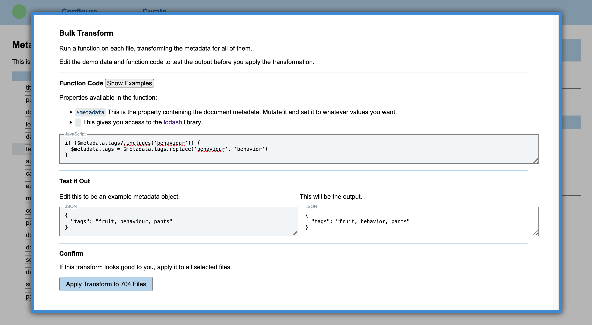

# Markdown Curator (mdcurate)

Tool for curating metadata (also called frontmatter) and content in markdown files.

With the Markdown Curator you can easily and safely:

- Rename metadata keys: did you mean `author` instead of `writer`? A few clicks and you've got it fixed.
- Conditionally change and tidy metadata fields. Change strings to lists, change capitalization, and much more.
- Easily find and correct files with bad metadata or other errors.

Instead of manually doing a search+replace, or trying to craft your own scripts or regular expressions, simply launch the Markdown Curator and let it help you.

You might be surprised what curiosities you find in your metadata!

## How to Use

You can use `npx` to launch `mdcurate` directly, without installing:

```bash
npx mdcurate
```

Or install as a permanent CLI tool using npm:

```bash
npm install -g mdcurate
# then launch
mdcurate
```

Running `mdcurate` launches a local server. You do the curation from your browser, but for privacy and security everything only happens locally: no external services are ever contacted, for any reason.

> Note: you can also pass in the `--here` (or `-h`) flag to launch it from a specific, singly directory. E.g. you can do `mdcurate --here` or `npx mdcurate --here` and it'll have your current directory loaded.

## Example

Imagine you have a growing collection of markdown files with frontmatter/metadata, and some look like this:

```md
---
title: My Blog Post
tags: fruit, behaviour, pants
---

The behaviour of pants-wearing is correlated with fruit consumption.
```

The curator screen for inspecting the `tags` metadata looks something like this:



If you found that in some files you used `tag` instead of `tags`, you can simply rename the property. If you have a metadata property that you don't use anymore, you can simply delete it:



Or if you wanted to change the tag `behaviour` to `behavior` across all files, you could use the bulk editor:



## Configuration

By default, this launches a server using port 3000. You can set that with the `--port` or `-p` flag:

```bash
# if installed globally
mdcurate -p 8080
# or with npx
npx mdcurate -p 8080
```

## License

Published and released under the [Very Open License](http://veryopenlicense.com).

If you need a commercial license, [contact me here](https://davistobias.com/license?software=mdcurate).
